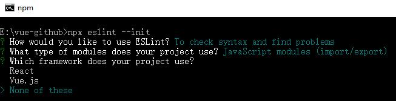
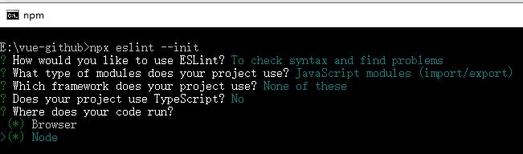
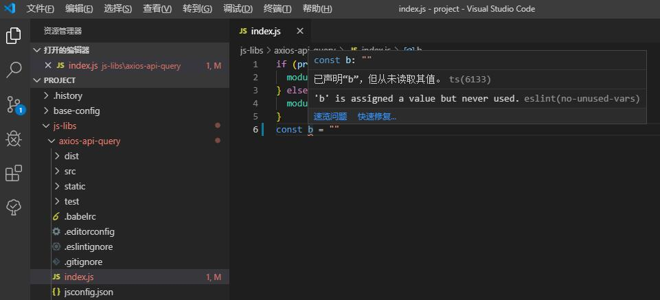

10 vscode配置eslint

场景：

在`vscode`编辑器里我们怎么去设置或者说怎么去安装`eslint`来达到让某个工程目录下的所有项目都能使用`eslint`的语法校验呢（就是说我们不需要给每一个项目都安装一遍`eslint`的相关依赖包）。

我的工程目录结构：

```
// 初始化的目录
vue-github
 |-project
    |-base-config
    |-js-libs
    |-vue-examples
    |-vue-frame
    |-放置项目的目录

// 最后完成后的目录
vue-github
 |-node_modules
 |-project
    |-base-config
    |-js-libs
    |-vue-examples
    |-vue-frame
    |-放置项目的目录
 |-.eslintrc.js 执行`npx eslint --init`自动生成不需要手动创建
 |-package.json
 |-package-lock.json

```

注意：

`eslint`如果是全局安装那么所有相关的依赖包都是需要全局安装的，不能有些依赖包全局了有些又安装在项目内这样会报找不到依赖包的错误（这里纠结了我很久的时间），我这里是都安装在了`vue-github`中的`node_modules`里面。

package.json

```
  "devDependencies": {
    "eslint": "^6.8.0",
    "eslint-config-standard": "^14.1.0",
    "eslint-plugin-html": "^6.0.0",
    "eslint-plugin-import": "^2.20.1",
    "eslint-plugin-node": "^11.0.0",
    "eslint-plugin-promise": "^4.2.1",
    "eslint-plugin-standard": "^4.0.1"
  }
```

附上`npm`安装：

```
E:\vue-github>cnpm i eslint eslint-config-standard eslint-plugin-standard eslint-plugin-promise eslint-plugin-import eslint-plugin-node eslint-plugin-html -D
```

安装完依赖包后，我们就要执行这么一个指令来初始化`eslint`：

这里注意是`npx`，`npx`是表示指令运行在当前的`node_modules`环境下。

```
E:\vue-github>npx eslint --init
```

接下来就是一路选择（我直接上图）：

1.


2.


3.


4.


5.


6.


7.


8.


9.


10.



设置完这些步骤后你就会在`vue-github`的目录下发现`.eslintrc.js`文件就自动生成了，这样`vscode`中配置`eslint`语法高亮提示就完成了。

接下来在`project`中的项目在`vscode`中就都可以实现语法检查了。
